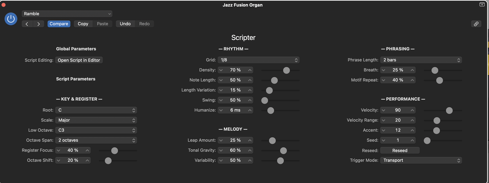

# Ramble — Parameter Guide

What every knob on the Scripter panel does, what it's for, and where to start.
This is the player's manual; the engineering rationale behind each control lives
in [spec/SPEC.md](spec/SPEC.md).

*The Phase-0 panel, as Scripter renders it (shown at the defaults). The JUCE
plugin (M7–M8) will replace this with its own GUI; the controls and their
behavior stay the same.*

## How Ramble thinks (read this first)

Ramble improvises in **phrases**, not notes. At each phrase boundary it rolls
dice — seeded by the **Seed** and the phrase's position in the song — and
decides: does this phrase restate the last one or say something new? Does it
move to a different octave? Which grid slots sound, and which pitches land on
them? Every knob below shapes those dice: most parameters are *tendencies*
(percentages that make outcomes more or less likely), not commands.

Two consequences worth internalizing:

- **The same Seed and settings always produce the same solo.** Bar 33 plays the
  same notes whether you start playback at bar 1 or bar 32, and playback,
  freeze, and bounce are identical. You can audition seeds like takes, and keep
  the one that sings.
- **Knob changes take effect from the next phrase.** The phrase currently
  sounding finishes the way it was planned; the new setting applies to
  everything after it. Nothing glitches mid-gesture.

Defaults below are shown as **(default)** and are a genuinely musical starting
point: an A-minor-pentatonic-style line between C3 and C5 with moderate density
and phrasing. Turn one knob at a time and you'll hear what it owns.

---

## Key & Register

| Parameter | Range (default) | In short |
|---|---|---|
| Root | C … B **(C)** | The key center |
| Scale | 8 scales **(Minor Pentatonic)** | The note palette and its hierarchy |
| Low Octave | C1 … C5 **(C3)** | Bottom of the playable range |
| Octave Span | 1–4 octaves **(2)** | Size of the playable range |
| Register Focus | 0–100 % **(40)** | How tightly the line hugs its home octave |
| Octave Shift | 0–100 % **(20)** | Chance a phrase relocates by an octave |

**Root** and **Scale** define the palette. Every note Ramble plays is in the
chosen key — structurally, not by correction — so these are set-and-forget per
song section. Scales are not just note lists: each one ranks its degrees into
*stable* tones (root, third, fifth — where phrases like to land), *color* tones,
and *passing* tones, and the engine leans on that ranking whenever the music
needs to resolve (see Tonal Gravity).

- **Major** — bright and consonant; leans hard on the major triad.
- **Natural Minor** — the standard dark minor palette.
- **Harmonic Minor** — minor with a raised 7th; phrase endings pull strongly
  home, with a slightly exotic edge.
- **Dorian** — minor with a natural 6th; the jazzy/modal minor of jam-band
  vamps.
- **Mixolydian** — major with a flat 7th; dominant-chord rock and roll.
- **Major Pentatonic** — five notes, no half steps; sunny, country-adjacent,
  nothing can clash.
- **Minor Pentatonic** — the rock/blues workhorse and the default.
- **Blues** — minor pentatonic plus the ♭5. The blue note is treated as spice:
  it appears in passing but is heavily penalized on downbeats and phrase
  endings, because landing on it sounds like a mistake.

**Low Octave**, **Octave Span**, **Register Focus**, and **Octave Shift** are
one system — think of them as answering three different questions:

- *Where may the notes go?* Low Octave + Span set the hard range (default
  C3–C5, clamped at C7).
- *Where do they prefer to be?* Register Focus. At 0, the whole range is fair
  game and a wide span wanders aimlessly — a three-octave span with Focus at 0
  sounds like an arpeggiator having a nervous breakdown. At 100, the line hugs
  the center octave and only reaches out when the melody insists. The default
  40 gives the line a home it still leaves.
- *How often does that preference move?* Octave Shift is the per-phrase chance
  that "home" relocates up or down an octave for one phrase. At the default 20%
  roughly one phrase in five lives somewhere else — often enough to read as a
  device, rare enough to stay one. (With Span at 1 there is nowhere to go, and
  the knob is ignored.)

**Use cases:** a wide span (3) with high Focus (75) and moderate Shift (30) is
the most soloist-like setting — mostly one octave, with deliberate excursions.
A narrow span (1–2) with any Focus is safe for basses and low pads. Raise Low
Octave to C4+ for sparkly EP/synth lines that sit above a dense mix.

---

## Rhythm

| Parameter | Range (default) | In short |
|---|---|---|
| Grid | 1/4, 1/8, 1/8T, 1/16, 1/16T, 1/32 **(1/8)** | The rhythmic lattice |
| Density | 0–100 % **(70)** | How many grid slots actually sound |
| Note Length | 5–150 % **(50)** | Gate: staccato ↔ legato |
| Length Variation | 0–100 % **(15)** | Random spread of gate lengths |
| Swing | 50–75 % **(50)** | Offbeat delay: straight ↔ shuffle |
| Humanize | 0–30 ms **(6)** | Timing jitter |

**Grid × Density is your notes-per-bar budget.** Grid sets the finest
subdivision the line may use; Density is the probability each slot sounds. The
same 70% density is a relaxed stream on 1/8 and a torrent on 1/32 — when the
output feels too busy, decide whether the problem is *speed* (drop the Grid) or
*fullness* (drop Density). Density 0 is silence; 100 fills every slot outside
the breath zones.

**Note Length** is a percentage of one grid step. Below ~50% you get the
percussive, staccato attack Ramble was designed around; around 100% notes touch;
above 100% they deliberately overlap for a legato, pseudo-portamento feel —
lovely on sustained synths, muddy on busy grids. **Length Variation** randomizes
each note's gate around that setting so lines don't sound machine-gated.

**Swing** delays every offbeat slot: 50% is straight, ~67% is a triplet
shuffle, 75% pushes the offbeat all the way to the last sixteenth. It only
applies to straight grids — the triplet grids (1/8T, 1/16T) are already
swinging and ignore it. **Humanize** adds a few milliseconds of random push and
pull to every note; 5–10 ms reads as human, 20+ as sloppy (which is sometimes
the point).

---

## Melody

| Parameter | Range (default) | In short |
|---|---|---|
| Leap Amount | 0–100 % **(25)** | Stepwise motion ↔ wide intervals |
| Direction Hold | 0–100 % **(70)** | Momentum: runs ↔ zigzag |
| Tonal Gravity | 0–100 % **(60)** | Pull toward chord tones on strong beats |
| Variability | 0–100 % **(50)** | Master predictability (temperature) |

These four shape *which pitch comes next*, and they interact more than any
other group. Ramble walks the scale one decision at a time, weighing every
candidate note by how far away it is, whether it continues the current
direction, how "home" it is in the scale, and where it sits in the register —
then these knobs decide how strictly those weights are obeyed.

**Leap Amount** — at 0 the line moves almost entirely by scale steps; raising
it makes fourths and fifths viable. Vocal-style lines want it low (10–25);
angular, horn-like lines want 40–60.

**Direction Hold** — melodic momentum. High values produce ascending and
descending *runs* that commit to a direction; low values noodle around a pitch.
When the line reaches the edge of its range it turns around rather than
bumping against the ceiling, so high Hold plus a decent Span gives long,
arcing contours. This knob is most of the answer to "does the line have shape?"

**Tonal Gravity** — how strongly strong beats and phrase endings pull toward
the scale's stable tones (root, third, fifth). At 0 the line floats — modal,
noncommittal, never really resolving. At 100 every downbeat leans on a chord
tone and every phrase ends emphatically home. This is the difference between
sounding *in* a key and merely *using its notes*. Lower it (15–35) over
ambiguous or shifting harmony; raise it (70–90) over a static vamp where you
want confident, singable resolution.

**Variability** — the one-knob answer to "how predictable?". It doesn't add
new behaviors; it sharpens or flattens all the melodic tendencies above at
once. At 0 the walk almost always takes its single best option — the line
sounds nearly written-out, and the same settings become practically an
arrangement. At 50, the model behaves as designed. At 100 the weights barely
matter: wild, exploratory, yet still incapable of leaving the key or the
range. Useful trick: Variability (and the other melody knobs) never changes
*which* slots sound — so you can freeze a rhythm you like and re-color its
pitches by sweeping this.

---

## Phrasing

| Parameter | Range (default) | In short |
|---|---|---|
| Phrase Length | 1, 2, 4, 8 bars **(2)** | The unit of musical thought |
| Breath | 0–100 % **(25)** | Forced silence at each phrase's tail |
| Motif Repeat | 0–100 % **(40)** | Chance a phrase restates the previous one |

**Phrase Length** sets the size of every gesture: breaths, endings, and motif
decisions all happen per phrase. Short phrases (1 bar) feel conversational and
riffy; long ones (4–8 bars) feel through-composed. Match it to your song's
harmonic rhythm — 2 bars against a 2-bar vamp locks the phrasing to the
changes.

**Breath** silences the trailing percentage of each phrase's final bar, and it
is the single biggest "sounds human" control. Players stop to breathe;
generators famously don't. At 0 the line runs on continuously; at 25 (default)
each phrase ends with a clear pause; at 60+ the line becomes sparse
call-and-response fragments. If the output feels relentless, reach here before
touching Density.

**Motif Repeat** is the chance that a phrase, instead of inventing new
material, *restates the previous phrase* — same rhythm, same contour — moved by
a couple of scale steps or a whole octave, with fresh dynamics and micro-timing
so it reads as a restatement rather than a loop. This is the largest single
contributor to the output sounding intentional: ideas come back, develop, and
move. Repeats chain at most twice before a fresh idea is forced, so it can
never get stuck. The octave version of a restatement — a figure answered an
octave up — is a signature jam-band gesture, and it emerges naturally when both
Motif Repeat and Octave Shift are up. At 0 every phrase is new material; at
70+ the solo becomes theme-and-variations.

---

## Performance

| Parameter | Range (default) | In short |
|---|---|---|
| Velocity | 1–127 **(90)** | Base loudness |
| Velocity Range | 0–64 **(20)** | Random dynamic spread |
| Accent | 0–40 **(12)** | Extra velocity on strong beats |
| Seed | 0–9999 **(1)** | Which take you get |
| Reseed | button | Roll a new random Seed |
| Trigger Mode | Transport / Latch **(Transport)** | When generation runs |

**Velocity / Velocity Range / Accent** shape dynamics together: every note
starts from Velocity, gets a random offset within ±half the Range, and strong
beats add Accent scaled by how strong they are — downbeats get the most, the
final note of every phrase always gets the full amount, offbeats get little.
For flat synth stabs, zero the Range and Accent; for expressive keys into a
velocity-sensitive instrument, try Velocity 80 / Range 30 / Accent 16.

**Seed** selects the take. Nothing else changes: two seeds with identical
settings are two different solos of the same character. Audition seeds until
one speaks, write the number down (or save a Scripter preset) and it will play
that exact solo forever — including on freeze and bounce. **Reseed** just
rolls a random new Seed when you'd rather gamble than count. To keep a take as
editable MIDI, render the same seed and settings with the CLI
(see the [README](README.md)) and drag the `.mid` into Logic.

**Trigger Mode** decides when Ramble speaks:

- **Transport** — generates whenever the project is playing. Your controller
  passes through to the instrument, so you can comp or double along with the
  generated line.
- **Latch** — generates only while at least one key is held (and the
  transport is running). Held keys are silent triggers — they gate the solo on
  and off, they don't choose its pitches. Because the timeline is
  deterministic, latching in at bar 33 plays exactly what bar 33 always
  contains: you're unmuting a soloist who was playing all along. Use it to
  punch fills into the gaps of a vocal, or to bring the solo in for one chorus
  from a pad.

---

## Recipes

Deltas from the defaults; everything else stays put.

**Sparse ballad line** — the soloist who leaves space.
`Density 45 · Note Length 95 · Breath 40 · Phrase Length 4 · Leap 15 ·
Direction Hold 80 · Tonal Gravity 75 · Variability 35`

**Percussive jam comping** — the default character, more committed.
`Note Length 40 · Swing 54 · Motif Repeat 55 · Octave Shift 30 ·
Octave Span 3 · Register Focus 70`

**Shuffle blues** — put it over a 12-bar and go.
`Scale Blues · Swing 67 · Tonal Gravity 70 · Density 60 · Phrase Length 1`

**Modal wash** — floaty, unresolved, atmospheric.
`Scale Dorian · Tonal Gravity 15 · Variability 70 · Register Focus 20 ·
Note Length 130 · Density 40 · Humanize 15`

**Sixteenth-note machine** — precision pattern generator.
`Grid 1/16 · Density 85 · Variability 10 · Length Variation 0 · Humanize 0 ·
Breath 10 · Velocity Range 6 · Accent 20`

---

## Which knobs change what

Handy when you have something you half-like:

- **Keep the notes, change the feel:** Note Length, Length Variation, Swing,
  Humanize, Velocity, Velocity Range, Accent, Trigger Mode. None of these
  alter which pitches or slots are chosen.
- **Keep the rhythm, change the melody:** Leap Amount, Direction Hold, Tonal
  Gravity, Variability, and (for a fixed span) Root/Scale swaps. The rhythmic
  skeleton for a given Seed stays put while the pitch choices re-color.
- **Re-roll the rhythm:** Grid, Density, Breath, Phrase Length — and Seed,
  which re-rolls everything.
- **Different take, same brief:** Seed / Reseed.
